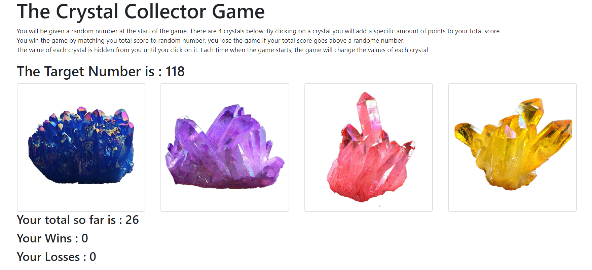
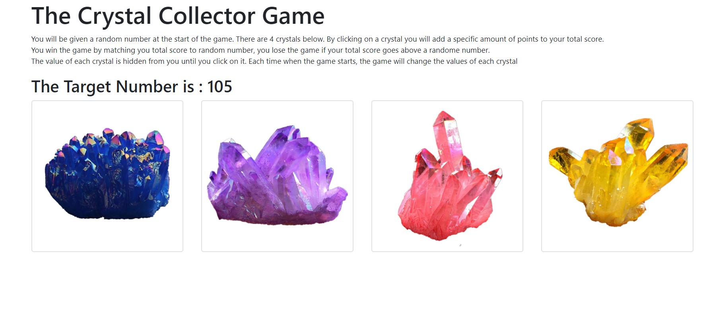
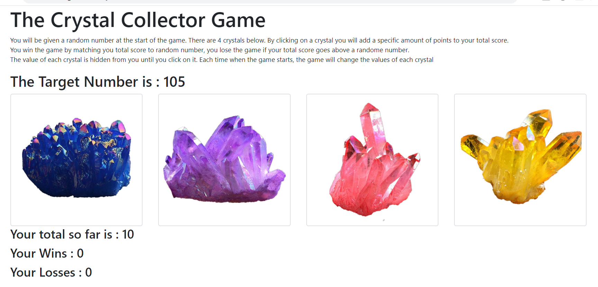
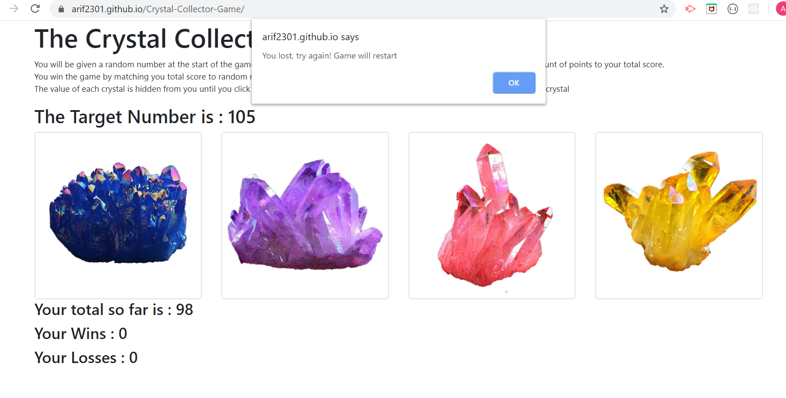
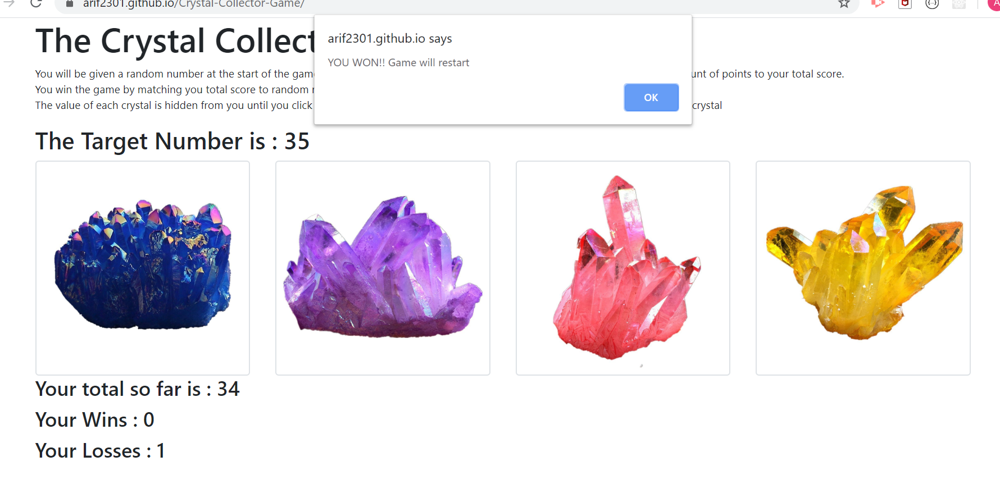

#  WELCOME TO THE CRYSTAL COLLECTOR GAME

Click on the crystals to add up to the target number without going over! This game runs on your browser. 

HTML, JAVASCRIPT and CSS were used to set this up

## Snapshot of the webpage:

## Guide to this project:

* Step 1: Click on the link - https://arif2301.github.io/Crystal-Collector-Game/ to go to the webpage. 

* Step 2: Each of the crystals have a randomly selected value. Using your deduction skills, get to the target number without going over.

* Step 3: If you go over, you get a pop up window telling you so and the game restarts, if you press okay on the pop up.

* Step 4: If you match the target number, you get a pop up window declaring your win and again the game restarts. Your score is tracked. To start from 0 score again, you can always refresh.

Thank you for veiwing this project.
